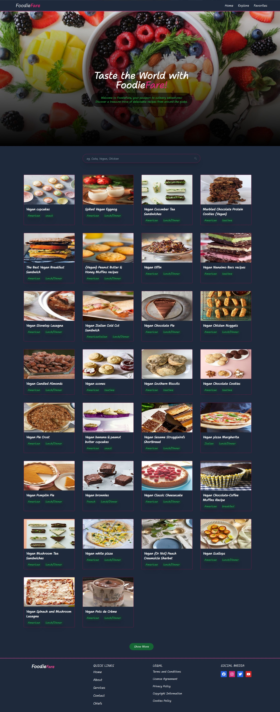
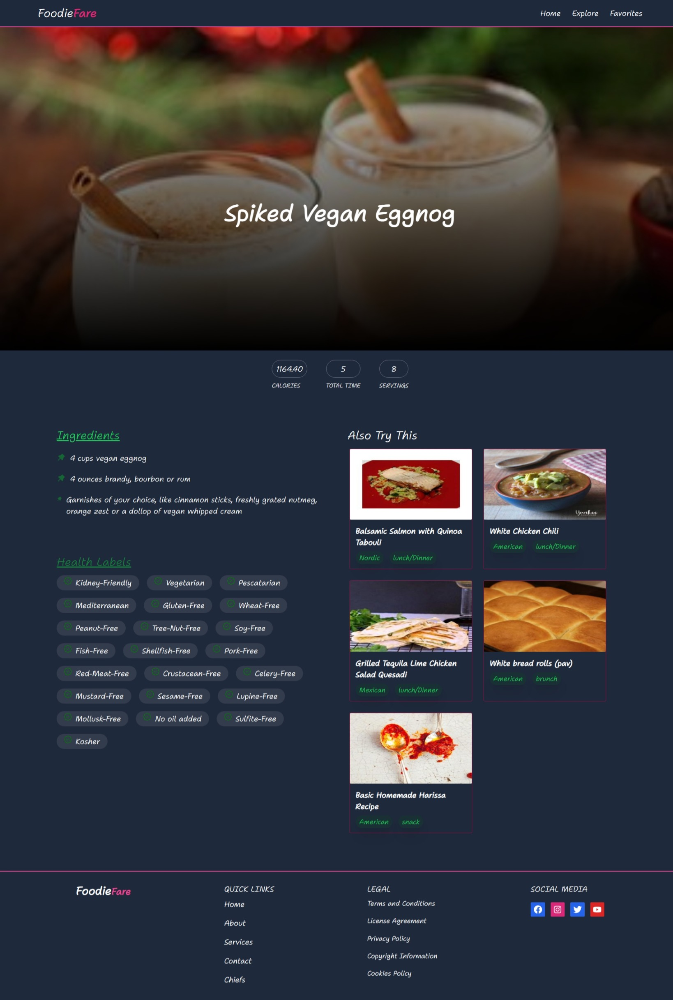

# RecipeApp
## Description :
FoodieFare is the recipeapp built using edamam api and Reactjs framework. TailwindCSS is used for designing the user interface of the application

## Technologies Used :
- React
- Tailwind CSS
- Edamam Recipe API
- React Router

## Installation :
1. Clone the repository
2. Install dependencies
```
npm install
```
3. Run the application
```
npm run dev
```
4. Open http://localhost:5173 to view it in the browser.

## Screenshots : 




